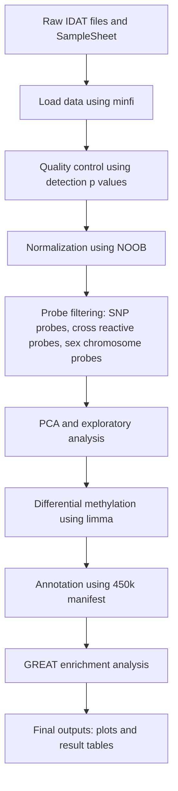

```mermaid
flowchart TD
    A[Raw IDAT files and SampleSheet] --> B[Load data using minfi]
    B --> C[Quality control using detection p values]
    C --> D[Normalization using NOOB]
    D --> E[Probe filtering: SNP probes, cross reactive probes, sex chromosome probes]
    E --> F[PCA and exploratory analysis]
    F --> G[Differential methylation using limma]
    G --> H[Annotation using 450k manifest]
    H --> I[GREAT enrichment analysis]
    I --> J[Final outputs: plots and result tables]


```
